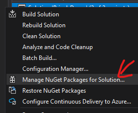
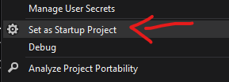
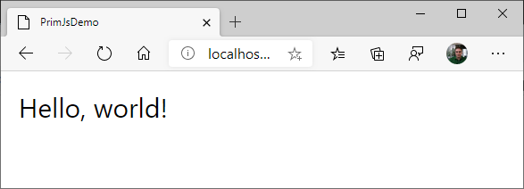
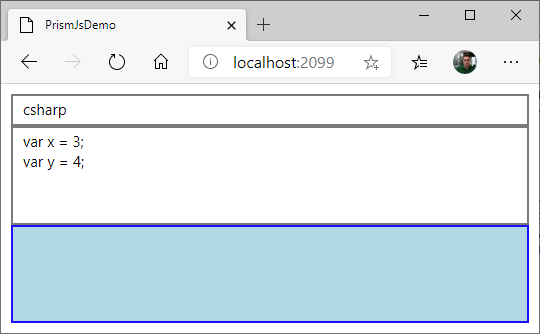
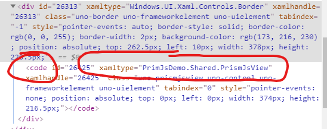

# Embedding Existing JavaScript Components Into Uno-WASM - Part 1

Uno fully embraces HTML5 as its display backend when targeting WebAssemble (WASM). As a result, it's possible to integrate with almost any existing JavaScript library to extend the behavior of an app.

This article will first review how Uno interoperates with HTML5, followed by a fully-worked example integration of a simple JavaScript-based syntax highlighter in an Uno project. In a future article we will go further and deeper into the .NET/JavaScript interop.

# Uno "Wasm" Bootstrapper - it starts here

Behind a Uno-Wasm project, there's a package called [`Uno.Wasm.Bootstrap`](https://github.com/unoplatform/Uno.Wasm.Bootstrap). It contains the tooling required to build, package, deploy and run a _.NET_ project in a web browser using WebAssembly. It's automatically included in the WASM head of an Uno app.

## Embedding assets

In the HTML world, everything running in the browser are assets that must be downloaded from a server. To integrate existing JavaScript frameworks, you can either download those from another location on the Internet (usually from a CDN service) or embed them with your app.

The Uno Bootstrapper can automatically embed any asset and deploy them with the app. Some of them (CSS & JavaScript) can also be loaded with the app. Here's how to declare them in a _Uno Wasm_ project:

1. **JavaScript files** should be in the `WasmScripts`  folder: they will be copied to the output folder and loaded automatically by the bootstrapper when the page loads. **They must be marked with the `EmbeddedResources` build action**:

   ``` xml
   <!-- .csproj file -->
   <ItemGroup>
     <EmbeddedResource Include="WasmScripts\javascriptfile.js" />
     <EmbeddedResource Include="WasmScripts\**\*.js" /> <!-- globing works too -->    
   </ItemGroup>
   ```

2. **CSS Style files** should be in the `WasmCSS` folder: they will be copied to the output folder and referenced in the _HTML head_ of the application. **They must be marked with the `EmbeddedResources` build action**.

   ``` xml
   <!-- .csproj file -->
   <ItemGroup>
     <EmbeddedResource Include="WasmCSS\stylefile.css" />
     <EmbeddedResource Include="WasmCSS\**\*.css" /> <!-- globing works too -->    
   </ItemGroup>
   ```

3. **Asset files** should be marked with the `Content` build action in the app. The file will be copied to the output folder and will preserve the same relative path.

   ``` xml
   <!-- .csproj file -->
   <ItemGroup>
     <Content Include="Assets\image.png" />
   </ItemGroup>
   ```

4. Alternatively, **any kind of asset file** can be placed directly in the `wwwroot` folder as you would do with any standard ASP.NET Core project. They will be deployed with the app, but the application code is responsible for fetching and using them.

   > **Is it an ASP.NET Core "web" project?**
   > No, but it shares a common structure. Some of the deployment features, like the `wwwroot` folder, and the Visual Studio integration for running/debugging are reused in a similar way to an ASP.NET Core project. The C# code put in the project will run in the browser, using the .NET runtime. There is no need for a server side component in Uno-Wasm projects.

## Uno-Wasm controls are actually HTML5 elements

The [philosophy of Uno](https://platform.uno/docs/articles/concepts/overview/philosophy-of-uno.html) is to rely on native platforms where it makes sense. In the context of a browser, that's the HTML5 DOM. This means that each time is created, a class deriving from `UIElement` is creating a corresponding HTML element.

That also means that it is possible to control how this element is created.  By default it is a `<div>`, but it can be changed in the constructor by providing the `htmlTag` parameter to the one required. For example:

``` csharp
// MyControl constructors
public MyControl() : base() // will create a "div" HTML element
public MyControl() : base("input") // Will create an "input" HTML element
public MyControl() : base(htmlTag: "span") // Will create a "span" HTML element
```

Once created, it is possible to interact directly with this element by calling helper methods available in Uno. Note that those methods are only available when targeting the _Wasm_ platform. It is possible to use [conditional code](https://platform.uno/docs/articles/platform-specific-csharp.html) to use these methods in a multi-platform project.

Here is a list of helper methods used to facilitate the integration with the HTML DOM:

* The method `base.SetStyle()` can be used to set a CSS Style on the HTML element. Example:

  ``` csharp
  // Setting only one CSS style
  SetStyle("text-shadow", "2px 2px red");
  
  // Setting many CSS styles at once using C# tuples
  SetStyle(("text-shadow", "2px 2px blue"), ("color", "var(--app-fg-color1)"));
  ```

* The method `base.ResetStyle()` can be used to set CSS styles to their default values. Example:

  ``` csharp
  // Reset text-shadow style to its default value
  ResetStyle("text-shadow");
  
  // Reset both text-shadow and color to their default values
  ResetStyle("text-shadow", "color");
  ```

* The `base.SetAttribute()` and `base.RemoteAttribute()` methods can be used to set HTML attributes on the element:

  ``` csharp
  // Set the "href" attribute of an <a> element
  SetAttribute("href", "#section2");
  
  // Set many attributes at once
  SetAttribute(("target", "_blank"), ("referrerpolicy", "no-referrer"));
  
  // Remove attribute from DOM element
  RemoveAttribute("href");
  ```

* The method `base.SetHtmlContent()` can be used to set arbitrary HTML content as child of the control.

  ``` csharp
  SetHtmlContent("<h2>Welcome to Uno Platform!</h2>");
  ```

  > Note: should not be used when there's children "managed" controls: doing so can result in inconsistent runtime errors because of desynchronized visual tree.

* Finally, it is possible to invoke an arbitrary JavaScript code by using the static method `WebAssembleRuntime.InvokeJS()`. The script is directly executed in the context of the browser, giving the ability to perform anything that JavaScript can do. The `HtmlId` property of the element can be used to locate it in JavaScript code.
  If the control has been loaded (after the `Loaded` routed event has been raised), it will be available immediatly by calling `document.getElementById()`. But it is also possible to access it before that by using the  `Uno.UI.WindowManager.current.getView(<HtmlId>)` function in JavaScript.

To illustrate how it is possible to use this in a real application, let's create one to integrate a pretty simple Syntax Highlighter named [`PrismJS`](https://prismjs.com/).

# Integration of PrismJS in a project

## 0. Before starting

📝 To reproduce the code in this article, you must [prepare development environment using Uno's _Getting Started_ article](https://platform.uno/docs/articles/get-started.html).

## 1. Create the projects

🎯 This section is very similar to the [Creating an app - Tutorial](https://platform.uno/docs/articles/getting-started-tutorial-1.html) in the official documentation.

1. Start **Visual Studio 2019**

2. Click `Create a new project`
   

3. **Search for "Uno"** and pick `Cross-Platform App (Uno Platform)`.
   
   Select it and click `Next`.

4. Give a project name and folder as you wish. It will be named `PrismJsDemo` here.

5. Click `Create` button.

6. Right-click on the solution and pick `Manage NuGet Packages for Solution...`
   

7. Update to latest version of `Uno` dependencies. **DO NOT UPDATE THE `Microsoft.Extensions.Logging` dependencies** to latest versions.

   > This step of upgrading is not absolutely required, but it's a good practice to start a project with the latest version of the library.

8. Right-click on the `.Wasm` project in the _Solution Explorer_ and pick `Set as Startup Project`.
   

   > Note: this article will concentrate on build Wasm-only code, so it won't compile on other platforms' projects.

9. Press `CTRL-F5`. App should compile and start a browser session showing this:
   

   > Note: when compiling using Uno platform the first time, it could take some time to download the latest .NET for WebAssembly SDK into a temporary folder. 

## 2. Create a control in managed code

🎯 In this section, a control named `PrismJsView` is created in code and used in the XAML page (`MainPage.xaml`) to present it.

1. From the `.Shared` project, create a new class file named `PrismJsView.cs`. and copy the following code:

   ```csharp
   using System;
   using System.Collections.Generic;
   using System.Text;
   using Windows.UI.Xaml;
   using Windows.UI.Xaml.Controls;
   using Windows.UI.Xaml.Markup;
   using Uno.Foundation;
   
   namespace PrismJsDemo.Shared
   {
       [ContentProperty(Name = "Code")]
       public class PrismJsView : Control
       {
           // *************************
           // * Dependency Properties *
           // *************************
   
           public static readonly DependencyProperty CodeProperty = DependencyProperty.Register(
               "Code",
               typeof(string),
               typeof(PrismJsView),
               new PropertyMetadata(default(string), CodeChanged));
   
           public string Code
           {
               get => (string)GetValue(CodeProperty);
               set => SetValue(CodeProperty, value);
           }
   
           public static readonly DependencyProperty LanguageProperty = DependencyProperty.Register(
               "Language",
               typeof(string),
               typeof(PrismJsView),
               new PropertyMetadata(default(string), LanguageChanged));
   
           public string Language
           {
               get => (string)GetValue(LanguageProperty);
               set => SetValue(LanguageProperty, value);
           }
   
           // ***************
           // * Constructor *
           // ***************
   
           public PrismJsView() : base("code") // PrismJS requires a <code> element
           {
               // Any HTML initialization here
           }
   
           // ******************************
           // * Property Changed Callbacks *
           // ******************************
   
           private static void CodeChanged(DependencyObject dependencyobject, DependencyPropertyChangedEventArgs args)
           {
               // TODO: generate HTML using PrismJS here
           }
   
           private static void LanguageChanged(DependencyObject dependencyobject, DependencyPropertyChangedEventArgs args)
           {
               // TODO: generate HTML using PrismJS here
           }
       }
   }
   
   ```

   This will define a control having 2 properties, one code `Code` and another one for `Language`.

2. Change the `MainPage.xaml` file to the following content:

   ``` xaml
   <Page
       x:Class="PrismJsDemo.MainPage"
       xmlns="http://schemas.microsoft.com/winfx/2006/xaml/presentation"
       xmlns:x="http://schemas.microsoft.com/winfx/2006/xaml"
       xmlns:local="using:PrismJsDemo"
       xmlns:d="http://schemas.microsoft.com/expression/blend/2008"
       xmlns:mc="http://schemas.openxmlformats.org/markup-compatibility/2006"
       mc:Ignorable="d">
   
       <Grid Padding="10">
           <Grid.RowDefinitions>
               <RowDefinition Height="Auto" />
               <RowDefinition Height="*" />
               <RowDefinition Height="*" />
           </Grid.RowDefinitions>
   
           <TextBox x:Name="lang" Text="csharp" Grid.Row="0" />
           <TextBox x:Name="code" Text="var x = 3;&#xA;var y = 4;" AcceptsReturn="True" VerticalAlignment="Stretch" Grid.Row="1" />
   
           <Border BorderBrush="Blue" BorderThickness="2" Background="LightBlue" Padding="10" Grid.Row="2">
               <local:PrismJsView Code="{Binding Text, ElementName=code}" Language="{Binding Text, ElementName=lang}"/>
           </Border>
       </Grid>
   </Page>
   ```

3. Press CTRL-F5.  You should see this:
   

4. Press F12 (on Chrome, may vary on other browsers).

5. Click on the first button and select the light-blue part in the app.
   

6. It will bring the DOM explorer to a `xamltype=Windows.UI.Xaml.Controls.Border` node. The `PrismJsView` should be right below after opening it.

   
   The `xamltype="PrismJsDemo.Shared.PrismJsView"`) control is there!

📝 The project is now ready to integrate PrismJS.

## 3. Add JavaScript & CSS files

🎯 In this section, PrismJS files are downloaded from their website and placed as assets in the app.

1. Go to this link: https://prismjs.com/download.html

2. Choose desired Themes & Languages (`Default` theme + all languages is used for the demo)

3. Press the `DOWNLOAD JS` button and put the `prism.js` file in the `WasmScripts` folder of the `.Wasm` project.

   > Putting the `.js` file in this folder will instruct the Uno Wasm Bootstrapper to automatically load the JavaScript file during startup.

4. Press the `DOWNLOAD CSS` button and put the `prism.css` file in the `WasmCSS` folder of the `.Wasm` project.

   > Putting the `.css` file in this folder will instruct the Uno Wasm Bootstrapper to automatically inject a `<link>` HTML instruction in the resulting `index.html` file to load it with the browser.

5. Right-click on the `.Wasm` project node in the Solution Explorer, and pick `Edit Project File` (it can also work by just selecting the project, if the `Preview Selected Item` option is activated).

6. Insert this in the appropriate `<ItemGroup>`:

   ```xml
   <ItemGroup>
     <EmbeddedResource Include="WasmCSS\Fonts.css" />
     <EmbeddedResource Include="WasmCSS\prism.css" /> <!-- This is new -->
     <EmbeddedResource Include="WasmScripts\AppManifest.js" />
     <EmbeddedResource Include="WasmScripts\prism.js" /> <!-- This one too -->
   </ItemGroup>
   ```

   > For the Uno Wasm Bootstrapper to take those files automatically and load them with the application, they have to be put as embedded resources. A future version of Uno may remove this requirement.

7. Compile & run

8. Once loaded, press F12 and go into the `Sources` tab. Both `prism.js` & `prism.css` files should be loaded this time.
   

## 4. Integration

🎯 In this section, PrismJS is used from the app.

1. First, there is a requirement for _PrismJS_ to set the  `white-space` style at a specific value, as [documented here](https://github.com/PrismJS/prism/issues/1237#issuecomment-369846817). An easy way to do this is to set in directly in the constructor like this:

   ``` csharp
   public PrismJsView() : base("code") // PrismJS requires a <code> element
   {
       // This is required to set to <code> style for PrismJS to works well
       // https://github.com/PrismJS/prism/issues/1237#issuecomment-369846817
       SetStyle("white-space", "pre-wrap");
   }
   ```

2. Now, we need to create an `UpdateDisplay()` method, used to generate HTML each time there's a new version to update. Here's the code for the method to add in the `PrismJsView` class:

   ``` csharp
   private void UpdateDisplay(string oldLanguage = null, string newLanguage = null)
   {
       string javascript = $@"
           (function(){{
               // Prepare Prism parameters
               const code = ""{WebAssemblyRuntime.EscapeJs(Code)}"";
               const oldLanguageCss = ""language-{WebAssemblyRuntime.EscapeJs(oldLanguage)}"";
               const newLanguageCss = ""language-{WebAssemblyRuntime.EscapeJs(newLanguage)}"";
               const language = ""{WebAssemblyRuntime.EscapeJs(newLanguage ?? Language)}"";
   
               // Process code to get highlighted HTML
               const prism = window.Prism;
               let html = code;
               if(prism.languages[language]) {{
                   // When the specified language is supported by PrismJS...
                   html = prism.highlight(code, prism.languages[language], language);
               }}
   
               // Get HTML element
               const element = document.getElementById(""{HtmlId}"");
               if(!element) return; // Not in DOM yet
   
               // Display result
               element.innerHTML = html;
   
               // Set CSS classes, when required
               if(oldLanguageCss) {{
                   element.classList.remove(oldLanguageCss);
               }}
               if(newLanguageCss) {{
                   element.classList.add(newLanguageCss);
               }}
           }})();";
   
       WebAssemblyRuntime.InvokeJS(javascript);
   }
   ```

3. Change `CodeChanged()` and `LanguageChanged()` to call the new `UpdateDisplay()` method:

   ``` csharp
   private static void CodeChanged(DependencyObject dependencyobject, DependencyPropertyChangedEventArgs args)
   {
       (dependencyobject as PrismJsView)?.UpdateDisplay();
   }
   
   private static void LanguageChanged(DependencyObject dependencyobject, DependencyPropertyChangedEventArgs args)
   {
       (dependencyobject as PrismJsView)?.UpdateDisplay(args.OldValue as string, args.NewValue as string);
   }
   ```

4. We also need to update the result when the control is loaded in the DOM. So we need to change the constructor again like this:

   ``` csharp
   public PrismJsView() : base("code") // PrismJS requires a <code> element
   {
       // This is required to set to <code> style for PrismJS to works well
       // https://github.com/PrismJS/prism/issues/1237#issuecomment-369846817
       SetStyle("white-space", "pre-wrap");
   
       // Update the display when the element is loaded in the DOM
       Loaded += (snd, evt) => UpdateDisplay(newLanguage: Language);
   }
   ```

5. Compile & run.  It should work like this:
   

## 🔬 Going further

This sample is a very simple integration as there is no _callback_ from HTML to managed code and _PrismJS_ is a self-contained framework (it does not download any other javaScript dependencies).

Some additional improvements can be done to make the code more production ready:

* **Make the control multi-platform**. A simple way would be to use a WebView on other platforms, giving the exact same text-rendering framework everywhere. The code of this sample won't compile on other targets.
* **Create script files instead of generating dynamic JavaScript**. That would have the advantage of improving performance and make it easier to debug the code. A few projects are also using TypeScript to generate JavaScript. This approach is done by Uno itself for the `Uno.UI.Wasm` project: https://github.com/unoplatform/uno/tree/master/src/Uno.UI.Wasm.
* **Support more PrismJS features**. There are many [_plugins_ for PrismJS](https://prismjs.com/#plugins) that can be used. Most of them are very easy to implement.